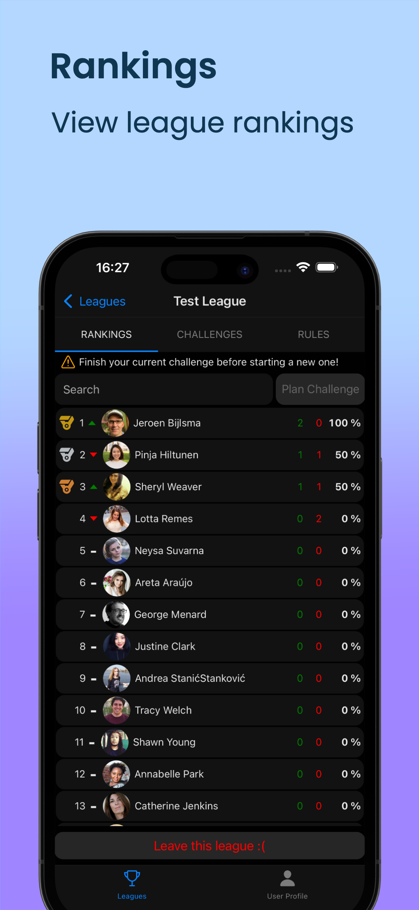
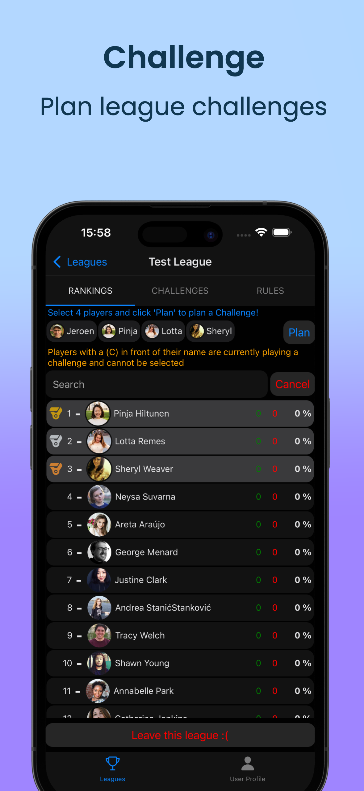
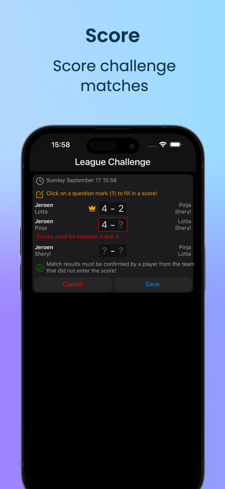
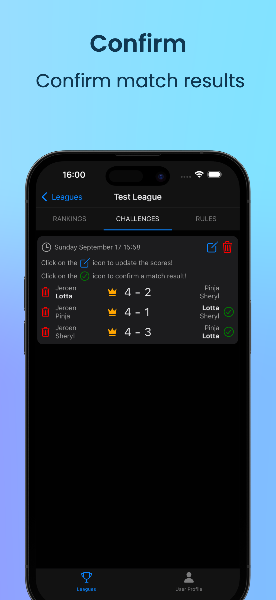
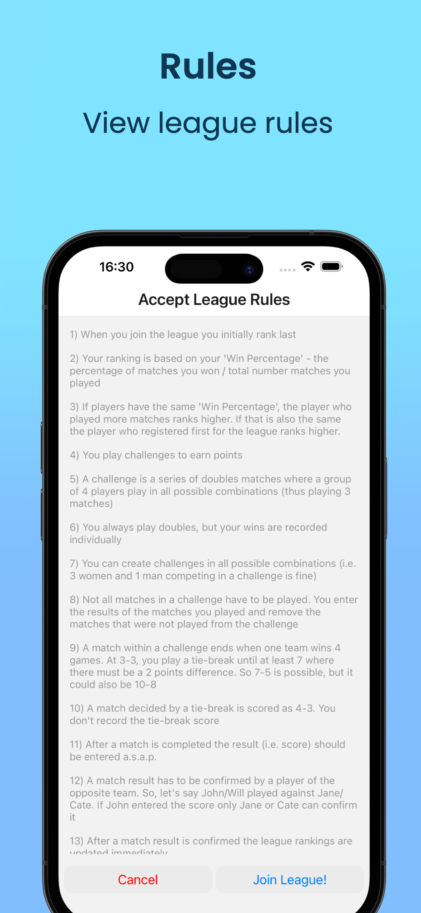
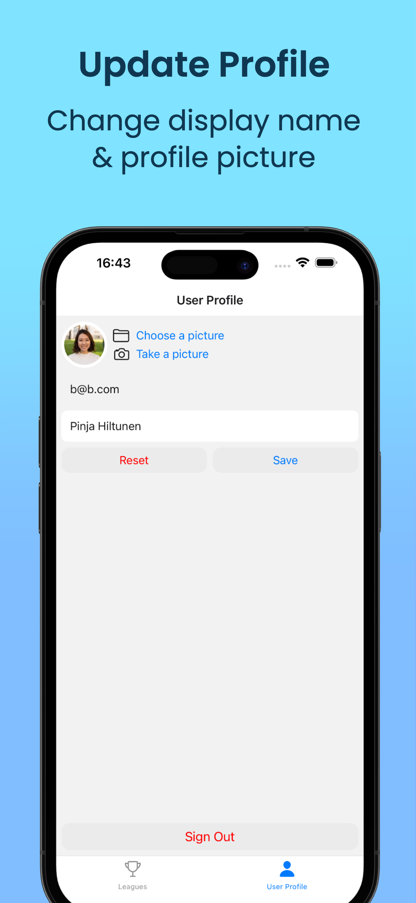

# Active Together

Fully functional iOS / Android App to enjoy (sports) activities together. The first version allows you to join sports leagues and is used in Singapore by the Singapore Beach Tennis Club.

Apple App Store: https://apps.apple.com/us/app/active-together/id6462838154?platform=iphone  
Google Play Store: https://play.google.com/store/apps/details?id=com.dotnet_works.active_together

  
  
  

  
  
  

  
  

These App screenshots were made using Screenshots Pro (https://screenshots.pro/) and the videos using Rotato (https://rotato.app/).

Features:

- Join & leave sports leagues
- View sports league rankings
- View sports league match results
- Plan sports league challenges
- Score sports league challenge matches
- Confirm sports league challenge matches
- Sign in using email and password
- Register users with email & password
- Update User Profile (display name & profile picture)
- Send password reminders
- Set up users as beta testers in Apple Connect and the Google Play Console

Tech stack:

- NodeJs with TypeScript
- Google Firebase (Auth, Realtime DB, Storage)
- Google Cloud Functions (Google Cloud Run)
- React Native (Javascript)
- Expo
- EAS build & EAS deploy
- Apple Connect API & Google Play API

Source Code Repository (private):

https://github.com/jbijlsma/active-together-league
